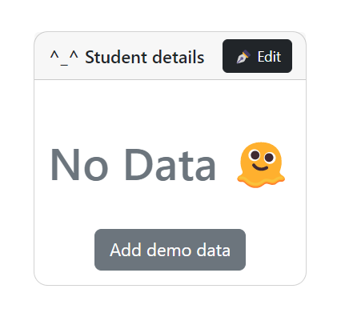
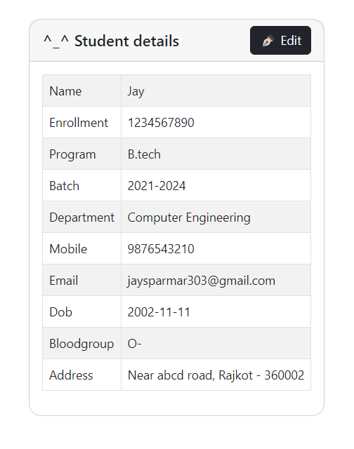
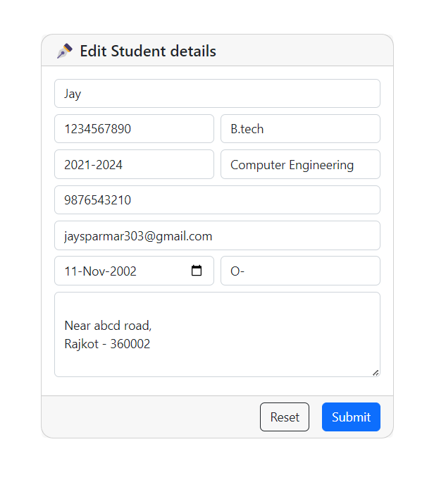

# Form in ReactJS


<span style="width:10px ;height:1px; display: inline-block"></span>


### App is live here : *https://jay-s-p.github.io/coc-react/form/dist/*

<br>

## Screenshots






### 🚀 Run app

```
npm i && npm run dev
```

###### _if you find any errors in code, you can contact me here..._

[](https://instagram.com/jay__s__p)
