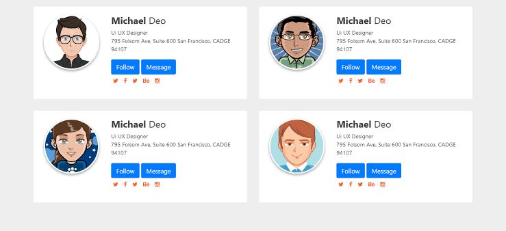

# Student Id Card

- design student icard front and back two components

# Todo app

- todo list with edit function where ✅ sign we use ✏ for edit and ❌ for delete

# MCQ test

- Two Buttons Required *next & previous*
- make 5 questions mcq test with result radiobutton last question show submit button to finish exam
- make 5 questions mcq test with result radiobutton last question show submit button to finish exam
- you can move question based on rightside list of questions

# Student profile

- student profile with all attributes like marks and all skills progress

# Developers profile

- make developers profile in respective nature using antdesign grid system multiple device abilities xs, md, lg
- xs - 1 columns
- md - 2 columns
- lg - 4 columns

1. Developer Name
2. Designation
3. Qualification
4. Years of Experience 
5. Home City
6. Job City
7. Platforms / Technology Work
- search make filter based on working technology

# Filter course

- filter course title
- sidebar list of courses
- like, Javascript, Html, Css, Java, Php, etc, 